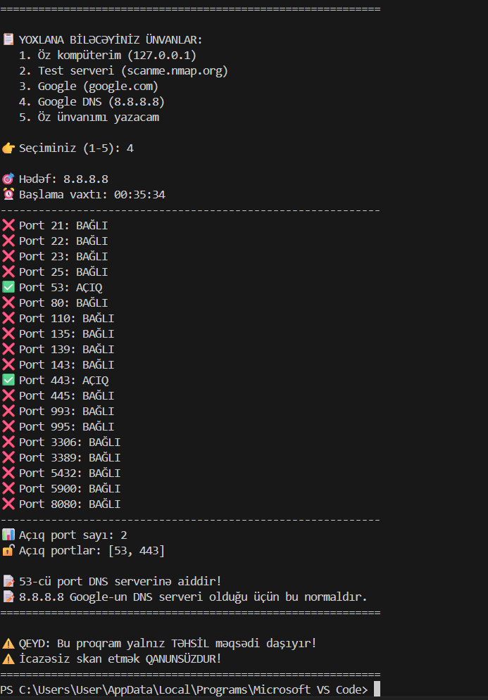

# 🔍 Port Skayneri - Beginner Cybersecurity Project

Bu layihə kiber təhlükəsizlik öyrənməyə yeni başlayanlar üçün sadə port skayneridir.

## 🎯 Öyrədiklərim
- Socket proqramlaşdırma
- Port anlayışı (xüsusilə 53-cü port - DNS)
- TCP/IP əsasları
- Xəta idarəetməsi

## 🚀 İstifadə qaydası
```bash
python port_scanner.py
## 📸 Proqramın işlək vəziyyəti



**Nəticə:** Google DNS serverində (8.8.8.8) 53-cü port (DNS) və 443-cü port (HTTPS) açıqdır. Bu gözlənilən nəticədir.
